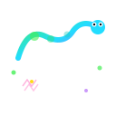

<p align="center">
  
</p>

<h1 align="center">Slither Evo v2</h1>

<p align="center">
  <b>AI evolution simulation — neural-network worms evolve in real-time</b>
</p>

<p align="center">
  
  
  
  
</p>

<p align="center">
  <a href="https://solveran601.github.io/slither-evo/">Play</a> •
  <a href="#features">Features</a> •
  <a href="#quick-start">Quick Start</a> •
  <a href="#controls">Controls</a> •
  <a href="#architecture">Architecture</a>
</p>

---

<p align="center">
  <a href="https://solveran601.github.io/slither-evo/">
    
  </a>
</p>

<p align="center">
  <b>No server needed — runs entirely in your browser with local bots</b>
</p>

## Features

- **Evolutionary AI** — teams of worms controlled by neural networks evolve via genetic algorithm (crossover, mutation, selection)
- **Real-time browser rendering** — HTML5 Canvas with particles, shadows, and smooth animations
- **Two game modes** — FFA (free-for-all) and Team mode with territorial zones
- **6 selection strategies**, **7 crossover methods**, **7 mutation methods** — hyperparameters self-tune during evolution
- **Hall of Fame** — best models are preserved across runs
- **Rich visual feedback** — leaderboard, epoch bar, fitness graphs, team zoning
- **Zero dependencies** — pure Python standard library, no pip install needed

## Quick Start

**Play in browser** (no server required):
→ [solveran601.github.io/slither-evo](https://solveran601.github.io/slither-evo/)

**Run with evolution server** (full AI training):
```bash
git clone https://github.com/Solveran601/slither-evo.git
cd slither-evo
python server.py
```
Open [http://127.0.0.1:8765](http://127.0.0.1:8765).

## Controls

| Key | Action |
|-----|--------|
| `Space` | Pause / resume |
| `+` / `-` | Speed up / slow down |
| `1` | 1× speed |
| `2` | 10× speed |
| `M` | Toggle FFA / Team mode |
| Click team | Focus camera on team |

## Game Modes

### FFA (Free-For-All)

All worms compete in a single arena. Only the strongest survive. Teams evolve independently — when all worms in a team die, its neural network pool undergoes evolution.

### Team Mode

Teams are assigned territories (zones). Worms fight for control of zones. Damage is dealt to worms outside their team's zone. Strategic positioning and territorial control become key.

## API

The server exposes a REST API at `http://127.0.0.1:8765`:

| Endpoint | Method | Description |
|----------|--------|-------------|
| `/config` | GET | Simulation parameters (world size, teams, NN shape, etc.) |
| `/weights` | GET | Best neural network weights per team |
| `/leaderboard` | GET | Team rankings sorted by fitness |
| `/stats` | GET | Current evolution statistics |
| `/fitness_history` | GET | Historical fitness data (last 500 generations) |
| `/hof` | GET | Hall of Fame — best model across all runs |
| `/teams` | GET | All team info (epoch, fitness, diversity) |
| `/team/<name>` | GET | Detailed stats for a specific team |
| `/zones` | GET | Zone positions (team mode) |
| `/history` | GET | Recent stats log |
| `/stats` | POST | Trigger evolution with `{alive, deadTeams}` |
| `/mode` | POST | Switch mode: `{mode: "ffa"}` or `{mode: "team"}` |

## Architecture

```
┌──────────────┐     HTTP      ┌──────────────────┐
│   Browser    │ ◄──────────► │  Python Server   │
│  (Canvas JS) │    fetch()    │  (server.py)     │
│              │              │                  │
│  • Render    │              │  • REST API      │
│  • NN infer  │              │  • Auto-save     │
│  • Input     │              │  • File serving  │
└──────────────┘              └───────┬──────────┘
                                      │
                            ┌─────────▼─────────┐
                            │   Evolution Engine │
                            │   (evolution.py)   │
                            │                    │
                            │  • Neural Nets     │
                            │  • Genetic Algo    │
                            │  • Selection       │
                            │  • Crossover       │
                            │  • Mutation        │
                            │  • Speciation      │
                            │  • Hall of Fame    │
                            └────────────────────┘
```

### Neural Network Architecture

Each worm is controlled by a feedforward neural network:

```
Input (26) → Hidden1 (20) → Hidden2 (14) → Hidden3 (10) → Output (2)
                                             1006 weights total
```

**Inputs:** direction to nearest food (8), nearest enemy (8), nearest ally (2), current speed (2), mass ratio (2), boundaries (4)

**Outputs:** left/right turn, speed modifier

## Project Structure

```
slither-evo/
├── server.py          # HTTP server & REST API endpoints
├── config.py          # Simulation parameters & constants
├── evolution.py       # Core evolution engine (35+ classes)
├── index.html         # Browser frontend (HTML5 Canvas + JS)
├── slither_evo/       # Python package
│   └── __init__.py
├── weights/           # Trained model weights (generated at runtime)
│   └── _hall_of_fame/ # Best models preserved across runs
└── docs/              # Documentation assets
    └── logo.svg
```


## License

MIT — see [LICENSE](LICENSE).

---

<p align="center">
  <sub>Built with Python & JavaScript — no frameworks, no dependencies.</sub>
</p>
